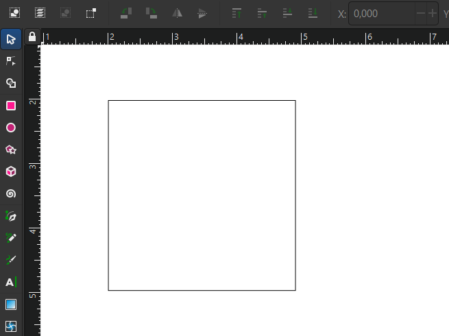

# HOW TO USE KNK FORCE
  
 ## Setup:

 ### Materials:
   - KNK Force
   - Charging Cable (has a sticker on it that says “KNK”)
   - WIFI Adapter or Ethernet cable 
   - Cutter blade
   - Cutting Mat
   - Pen (necessary for print and cut only)

 ### For WIFI Connection:
 Plug the device in and plug the WIFI adapter into it.

 ### For Ethernet Connection:
 Plug the ethernet and charging cable only.

 ## Connection:
   1. Press the start button.
   2. A blue light will blink (might take up to 1-2 minutes).
   3. Another light will appear after the blinking:
      - If it is Red: KNK doesn’t receive a connectable WIFI signal (WIFI adapter is required).
      - If it is Green: KNK is in recovery mode and needs a manual reset. See the instructions below.
      - If it is White: KNK is ready for the next step.
   4. Open WIFI settings from your PC and choose KNK_Force network.
   5. KNK is now connected to the PC.

 ### Problems with the connection?
 Check [Article 2.02.2](https://www.iloveknk.com/0um/Force-with-C3/KNKForce-with-C3-UM.pdf) in the PDF.

 ## Software:
   - Inkscape is compatible with the device.
   - IP address includes a software with it for cutting.

 ## First Cut:
   - You’ll need an IP Address to start cutting. (The KNK with “Print and Cut sticker” has 10.0.0.1 as an IP).
   - IP address can be obtained by:
   - Plug an Ethernet into the machine and the PC.
   - Run Command Prompt on PC.
   - Type ipconfig and see the results of the Ethernet Cable.
   - Or
   - Connect KNK to WIFI.
   - Connect to the KNK via WIFI.
   - Download Angry IP and search for the device.
 ## Cutting:
   - After you get the IP, type it into your search engine.
   - An Interface for KNK will show up.
   - Prepare a design from Inkscape for cutting.
       
   - After designing in Inkscape, follow File>Save As…>[Name of your file] and select .svg.
       
   - Open up the browser again and select "Upload a new SVG pattern:" 
   - Select your design and wait for the upload. Then return to the main page.
   - Set up your tool (see instructions below)
   - Place your mat and material (Check [Article 1.10](https://www.iloveknk.com/0um/Force-with-C3/KNKForce-with-C3-UM.pdf) for the mat details)
   - Select “Prepare this cutting job”
   - Adjust the starting position of your KNK using arrows and numpad (Depends on the mat and material size) 

 ## Setting up the Cutter/Pen tool:
   - Setup for the tool is needed after EVERY TIME you turn KNK on.
   - In the browser UI, select the replace left tool (ALWAYS use the left slot for single tool)
   - Take every tool out if they were left there in the previous session and click continue
   - Put the tool back in and adjust the screws. 
   - The tool is set up! For pen or blade tension and adjustments, make sure you read [Article 1.08](https://www.iloveknk.com/0um/Force-with-C3/KNKForce-with-C3-UM.pdf) in the PDF.

 ## Recovery Mode:
   
   ### Getting the device into recovery mode:
    
   * Unplug the WIFI adapter and plug the ethernet cable
   * Turn on the KNK and wait for the red light (might take 1-2 minutes)
   * Take the ethernet cable out and back in. Also, plug the WIFI adapter this time
   * Wait for the lights to turn green
   * Now the device is in recovery mode

  ### Setting up a KNK with recovery mode:

   * Select the KNK_Force_Recovery network from WIFI connections. A page will open up on the screen
   * Select LAN if you want to continue the connection with ethernet
   * Save the changes and click continue
   * An IP address will open up.
   * Connect to your regular WIFI network and refresh your KNK connection
   * It is connected and you are all set!

 ## For further questions,
   * Check the [C3 User Manual (recommended)](https://www.iloveknk.com/0um/Force-with-C3/KNKForce-with-C3-UM.pdf) or [SCAL 5 User Manual](https://www.iloveknk.com/0um/Force-with-SCAL5/KNKForce-with-SCAL5-UM.pdf).
   Or 
   * [KNK Manuals Page](https://www.iloveknk.com/support/knk-force-support-page/) for video support & more

  

 

  